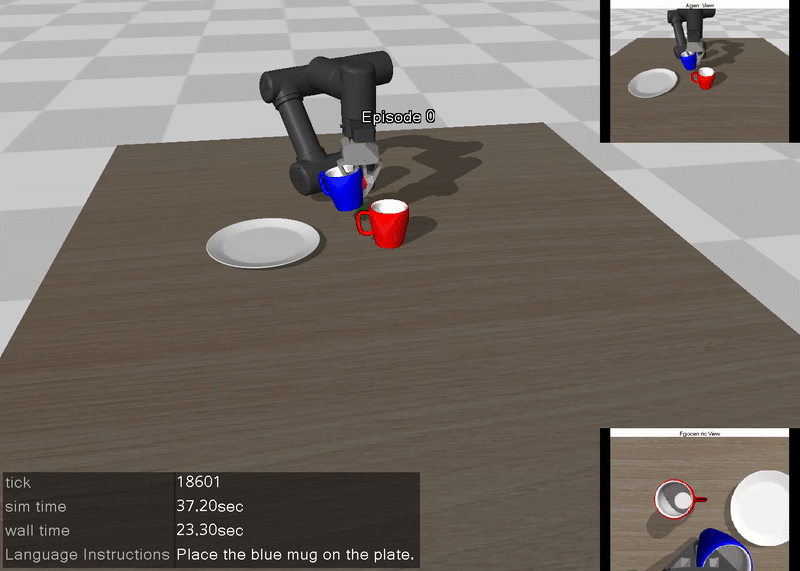

# LeRobot Tutorial with MuJoCo
This repository contains minimal examples for collecting demonstration data and training (or fine-tuning) vision language action models on custom datasets. 

## Table of Contents
- [:pencil: Installation](#installation)
- [:mega: Updates and Plans](#updates--plans)
- [:video_game: 1. Collect Demonstration Data](#1-collect-demonstration-data)
- [:movie_camera: 2. Playback Your Data](#2-playback-your-data)
- [:fire: 3. Train Action-Chunking-Transformer (ACT)](#3-train-action-chunking-transformer-act)
- [:pushpin: 4. Deploy ACT](#4-deploy-your-policy)
- [:floppy_disk: 5-6. Language conditioned Environment.](#5-6-collect-data-and-visualize-in-lanugage-conditioned-environment)
- [🤗 Models and Dataset](#models-and-dataset-)
- [:zap:7.Train and deploy pi_0](#7-train-and-deploy-pi_0)
- [:bulb:8.Train and deploy smolvla](#8-train-and-deploy-smolvla)
- [:pencil: Acknowledgements](#acknowledgements)

## Installation
We have tested our environment on python 3.10. 

I do **not** recommend installing lerobot package with `pip install lerobot`. This causes errors. 

Install mujoco package dependencies and lerobot
```
pip install -r requirements.txt
```
Make sure your mujoco version is **3.1.6**.

Unzip the asset
```
cd asset/objaverse
unzip plate_11.zip
```

### Updates & Plans

:white_check_mark: Viewer Update.

:white_check_mark: Add different mugs, plates for different language instructions.

:white_check_mark: Add pi_0 training and inference. 

:white_check_mark: Add SmolVLA

## 1. Collect Demonstration Data

Run [1.collect_data.ipynb](1.collect_data.ipynb)

Collect demonstration data for the given environment.
The task is to pick a mug and place it on the plate. The environment recognizes the success if the mug is on the plate, gthe ripper opened, and the end-effector positioned above the mug.


Use WASD for the xy plane, RF for the z-axis, QE for tilt, and ARROWs for the rest of rthe otations. 

SPACEBAR will change your gripper's state, and Z key will reset your environment with discarding the current episode data.

For overlayed images, 
- Top Right: Agent View 
- Bottom Right: Egocentric View
- Top Left: Left Side View
- Bottom Left: Top View

The dataset is contained as follows:
```
fps = 20,
features={
    "observation.image": {
        "dtype": "image",
        "shape": (256, 256, 3),
        "names": ["height", "width", "channels"],
    },
    "observation.wrist_image": {
        "dtype": "image",
        "shape": (256, 256, 3),
        "names": ["height", "width", "channel"],
    },
    "observation.state": {
        "dtype": "float32",
        "shape": (6,),
        "names": ["state"], # x, y, z, roll, pitch, yaw
    },
    "action": {
        "dtype": "float32",
        "shape": (7,),
        "names": ["action"], # 6 joint angles and 1 gripper
    },
    "obj_init": {
        "dtype": "float32",
        "shape": (6,),
        "names": ["obj_init"], # just the initial position of the object. Not used in training.
    },
},

```

This will make the dataset on './demo_data' folder, which will look like this,
```
.
├── data
│   ├── chunk-000
│   │   ├── episode_000000.parquet
│   │   └── ...
├── meta
│   ├── episodes.jsonl
│   ├── info.json
│   ├── stats.json
│   └── tasks.jsonl
└── 
```

For convenience, we have added [Example Data](./demo_data_example/) to the repository. 

## 2. Playback Your Data

Run [2.visualize_data.ipynb](2.visualize_data.ipynb)

</img>

Visualize your action based on the reconstructed simulation scene. 

The main simulation is replaying the action.

The overlayed images on the top right and bottom right are from the dataset. 

## 3. Train Action-Chunking-Transformer (ACT)

Run [3.train.ipynb](3.train.ipynb)

**This takes around 30~60 mins**.

Train the ACT model on your custom dataset. In this example, we set chunk_size as 10. 

The trained checkpoint will be saved in './ckpt/act_y' folder.

To evaluate the policy on the dataset, you can calculate the error between ground-truth actions from the dataset.

<image src="./media/inference.png"  width="480" height="360">

<details>
    <summary>PicklingError: Can't pickle <function <lambda> at 0x131d1bd00>: attribute lookup <lambda> on __main__ failed</summary>
If you have a pickling error, 
        
```
PicklingError: Can't pickle <function <lambda> at 0x131d1bd00>: attribute lookup <lambda> on __main__ failed
```

Please set your num_workers as 0, like, 

```
dataloader = torch.utils.data.DataLoader(
    dataset,
    num_workers=0, # 4
    batch_size=64,
    shuffle=True,
    pin_memory=device.type != "cpu",
    drop_last=True,
)
```
</details>

## 4. Deploy your Policy

Run [4.deploy.ipynb](4.deploy.ipynb)

You can download checkpoint from [google drive](https://drive.google.com/drive/folders/1UqxqUgGPKU04DkpQqSWNgfYMhlvaiZsp?usp=sharing) if you don't have gpu to train your model.

</img>

Deploy trained policy in simulation.


## 5-6. Collect data and visualize in lanugage conditioned environment

- [5.language_env.ipynb](5.language_env.ipynb): Collect Dataset with keyboard teleoperation. The command is same as first environment.
- [6.visualize_data.ipynb](6.visualize_data.ipynb): Visualize Collected Data


### Environment
**Data**

</img>


## Models and Dataset 🤗
<table>
  <tr>
    <th> Model 🤗 </th>
    <th> Dataset  🤗</th>
    </tr>
    <tr>
        <td> <a href="https://huggingface.co/Jeongeun/omy_pnp_pi0"> pi_0 finetuned </a></td>
        <td> <a href="https://huggingface.co/datasets/Jeongeun/omy_pnp_language"> dataset </a></td>
    </tr>
    <tr>
        <td> <a href="https://huggingface.co/Jeongeun/omy_pnp_smolvla"> smolvla finetuned </td>
        <td>  same dataset</td>
    </tr>
</table>

## 7. Train and Deploy pi_0
- [train_model.py](train_model.py): Training script
- [pi0_omy.yaml](pi0_omy.yaml): Training configuration file
- [7.pi0.ipynb](7.pi0.ipynb): Policy deployment


### Training Scripts
```
python train_model.py --config_path pi0_omy.yaml
```


### Rollout of trained policy

</img>


### Train logs

<image src="./media/wandb.png"  width="480" height="360">

### Configuration File
```
dataset:
  repo_id: omy_pnp_language # Repository ID
  root: ./demo_data_language # Your root for data file!
policy:
  type : pi0
  chunk_size: 5
  n_action_steps: 5
  
save_checkpoint: true
output_dir: ./ckpt/pi0_omy <- Save directory
batch_size: 16
job_name : pi0_omy
resume: false 
seed : 42
num_workers: 8
steps: 20_000
eval_freq: -1 # No evaluation
log_freq: 50
save_checkpoint: true
save_freq: 10_000
use_policy_training_preset: true
  
wandb:
  enable: true
  project: pi0_omy
  entity: <your_wandb_entity>
  disable_artifact: true
```

## 8. Train and Deploy Smolvla

- [train_model.py](train_model.py): Training script
- [smolvla_omy.yaml](smolvla_omy.yaml): Training configuration file
- [8.smolvla.ipynb](8.smolvla.ipynb): Policy deployment


### Training Scripts
```
python train_model.py --config_path smolvla_omy.yaml
```


### Rollout of trained policy

</img>


### Train logs

<image src="./media/wandb2.png"  width="480" height="360">

### Configuration File
```
dataset:
  repo_id: omy_pnp_language # Repository ID
  root: ./demo_data_language # Your root for data file!
policy:
  type : smolvla
  chunk_size: 5
  n_action_steps: 5
  device: cuda
  
save_checkpoint: true
output_dir: ./ckpt/smolvla_omy # Save directory
batch_size: 16
job_name : smolvla_omy
resume: false 
seed : 42
num_workers: 8
steps: 20_000
eval_freq: -1 # No evaluation
log_freq: 50
save_checkpoint: true
save_freq: 10_000
use_policy_training_preset: true
  
wandb:
  enable: true
  project: smolvla_omy
  entity: <your_wandb_entity>
  disable_artifact: true
```


## Acknowledgements
- The asset for the robotis-omy manipulator is from [robotis_mujoco_menagerie](https://github.com/ROBOTIS-GIT/robotis_mujoco_menagerie/tree/main).
- The [MuJoco Parser Class](./mujoco_env/mujoco_parser.py) is modified from [yet-another-mujoco-tutorial](https://github.com/sjchoi86/yet-another-mujoco-tutorial-v3). 
- We refer to original tutorials from [lerobot examples](https://github.com/huggingface/lerobot/tree/main/examples).  
- The assets for plate and mug is from [Objaverse](https://objaverse.allenai.org/).
